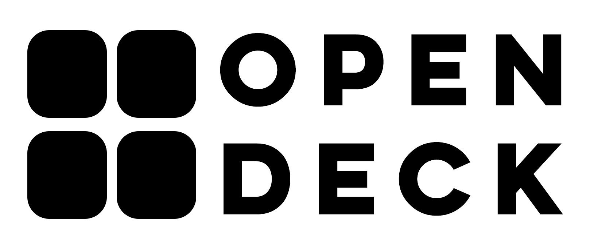
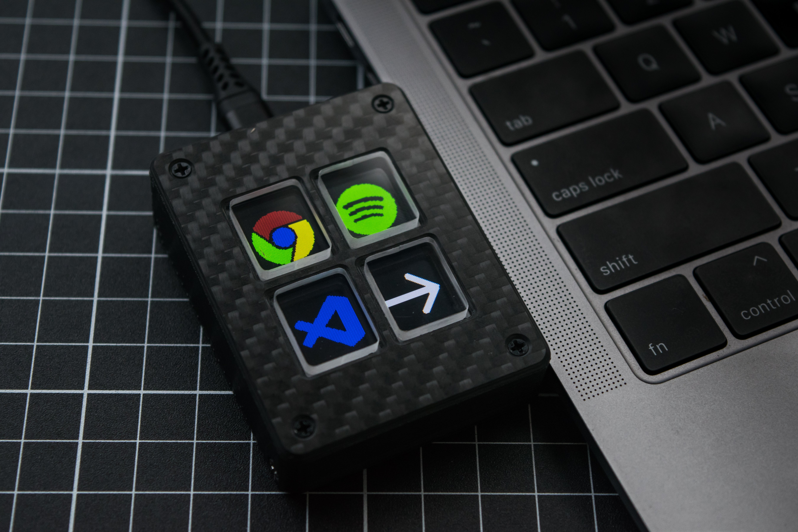
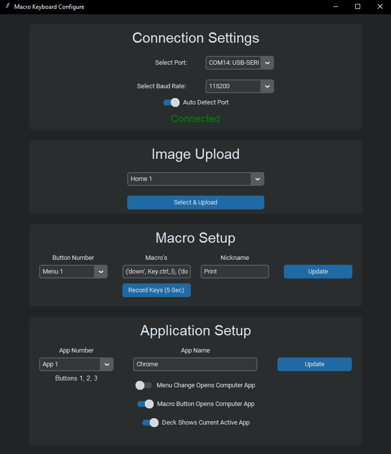
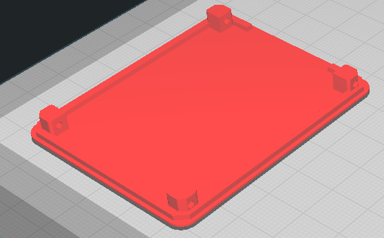
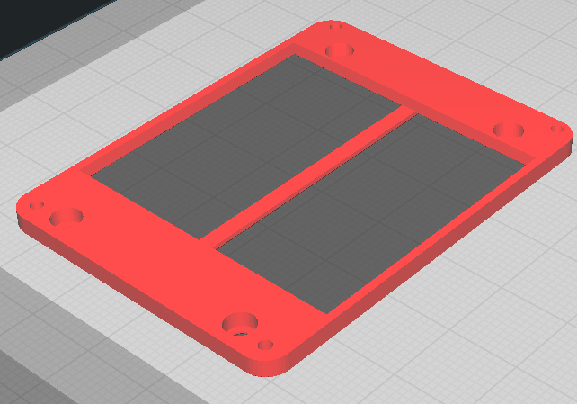
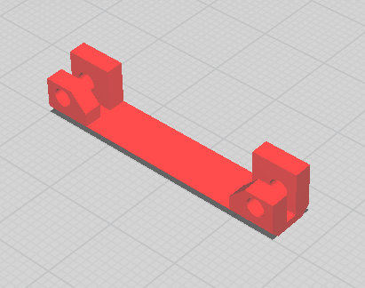

# Open Deck

## Parts and fully assembled units can be purchased Here: https://www.tindie.com/products/27756/  
 

⠀⠀⠀⠀⠀⠀⠀

Open Deck is a low cost open source macro keyboard with a customizable image behind every key.

Open Deck is an open source macro keyboard designed to be a cheaper alternative to the stream deck. It has software to easily change the images as well as the macros assigned to each button. The folder Structure allows 6 different apps to be configured with 3 macro keys each. The software allows the open deck to update with whatever app is open as well as open an app when buttons are pressed.

An easy to use interface allows you to easily upload and set macros.

Full Video and build guide here: https://youtu.be/SCIMHQAToSw

Thanks to PCBWay for their support on this project, the PCB's can be ordered directly from them by uploading the provided Gerbers. Check them out and support the project here: [PCBWay](https://pcbway.com/g/heg1oh)

The anodised aluminium parts for the custom aluminium version can be purchased from [PCBWay](https://pcbway.com/g/heg1oh) using the files in the "aluminium version" folder.

The aluminium version can be seen in this video: https://youtu.be/J708yBPJkeE

# Software:

## GUI Interface

Provided is a compiled .exe program as well as all the source code (written in python). Extract the zipped folder and run the .exe, no python libary installs required.

The Open Deck communicates with a PC over a serial USB connection. The software can automatically detect and connect to the Open Deck when it is plugged in.

The program is first used to upload images and set the macro's. After that it runs in the background to send keystrokes when the buttons are pressed.

Note: the automatic window switching only works on windows currently

The sofware is still evolving and I am by no means a software engineer but I have been using it everyday for over 6 months without an major issues.

## Uploading Images
The PC application makes it super easy to upload images. The files can be any size and the program does all of the conversion for you. At the moment each image can only be a single colour when uploaded through the GUI. When uploading an image the black part of the image will be shown in the chosen colour and the rest will be black. See Additional Features section for how to do images with multiple colours.

The select & upload button will prompt the user to select an image from the file system as well as choose a colour from a colour picker.

## Setting Macros
The macros are sent using the python keyboard library.

If more complex macros are required I recommend setting it to some unused combination and then remapping this combination using something like auto hot key. (Not going to try re-invent the wheel here). To send multiple key strokes one after another seperate them with a comma. The record keystroke feature is still a work in progress but should be able to get you started and give you names of keys.

## Window Switching/application setup
One usefull feature on the open deck has is the ability to have the buttons change depending on which application is currently open as well. It can also open an app when a button on the open deck is pressed.

By inputting the application name for each menu of the open deck, the program will look for a window containing this name to either control the open deck or have the open deck control/activate this window.

On windows there are 3 settings for automatically switching windows and/or current open deck state.

- The first option will open the application on the computer when the corresponding folder is opened on the keypad.

- The second option will open the corresponding computer application when a shortcut is sent. This is usefull if you have multiple applciations open at once as it will make the correct application active before sending the keystrokes.

- The third option will change which set of macros are shown on the keypad depending on which computer application is currently active.

## Arduino
All of the code running on the ESP8266 on the Open Deck itself is using arduino. The images are stored as a bitmap in SPIFFS so that they remain after a power cycle and are not relient on a computer connection.

When a key is pressed it sends a correlated number (1-16) over serial to the program running on the computer. 

If you purchase a pre-made Open Deck it will come flashed with the default firmware and you will not need to touch any arduino code or install any libraries. 
> For more info on the software see the README in the Code folder

# Hardware
See the BOM for a full list of all of the required components. Visit my tindie store to support the project by buying parts or a full unit: **https://www.tindie.com/products/27756/**

> If there is a particular item or set of items you would like to buy feel free to send me a message on Tindie.

Things of Note:

- The display is a 128x160 tft display. The exact display is quite important as the hole patten and pinout needs to fit the custom PCB's. (See BOM for Link)

- An ESP8266 is being used as the micro-controller as it is small, low cost, has enough flash memory to store all of the images as well as having WiFi to allow for additional features. Importantly for everything to fit this needs to be a WEMOS D1 Mini V4 with a USB-C Connector

- Low Profile M2 Screws used for clearance (Length is critical)

## 3D Printed Parts
All parts can be printed with no supports. Print in the orientation shown below:

Body:

Bottom Cover:

Window Holder:

Spacer:

## CNC Machined Parts
### Carbon Fibre Top Plate
The carbon top plate is made out of 1mm thick carbon fibre.

### Acrylic Key Caps
The 'Key Caps' are machined out of 4.5mm thick acrylic. They are all the same design.

These can also be made out of 1.5mm and 3mm laser cut acrylic glued together if you do not have access to a CNC. I have found the best glue for this is UV curable glue used for some phone screen protectors.

These could also potentially be 3D printed from clear resin and polished to get a transparent finish.

As with all the custom parts these are availale for purchase from the tindie store.

## PCB
The PCB folder contains a zipped folder of the GERBER files required to have the PCB manufactured. 

Support the project and order them here: [PCBWay.com](https://pcbway.com/g/heg1oh).

# Additional Features:
- If you want images with multiple colours these currently need to be manually entered into the arduino code. See the README in the Code folder for more info.

- Another use case for the open deck is to control smart home devices. The ESP8266 is a common WiFi chip and could be setup for controlling without needing to be physically connected to a host computer. 

  Currently no example code for this but simply change the serial write commands in the arduino program to send a comand with your favourite service such as MQTT. This can then be integrated with something like home assistant. Images can still be uploaded with the GUI interface and are stored locally on the device in non-volatile memory so will remain even after a power cycle.

 
 
